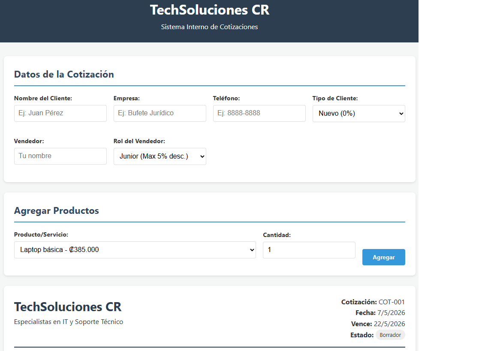
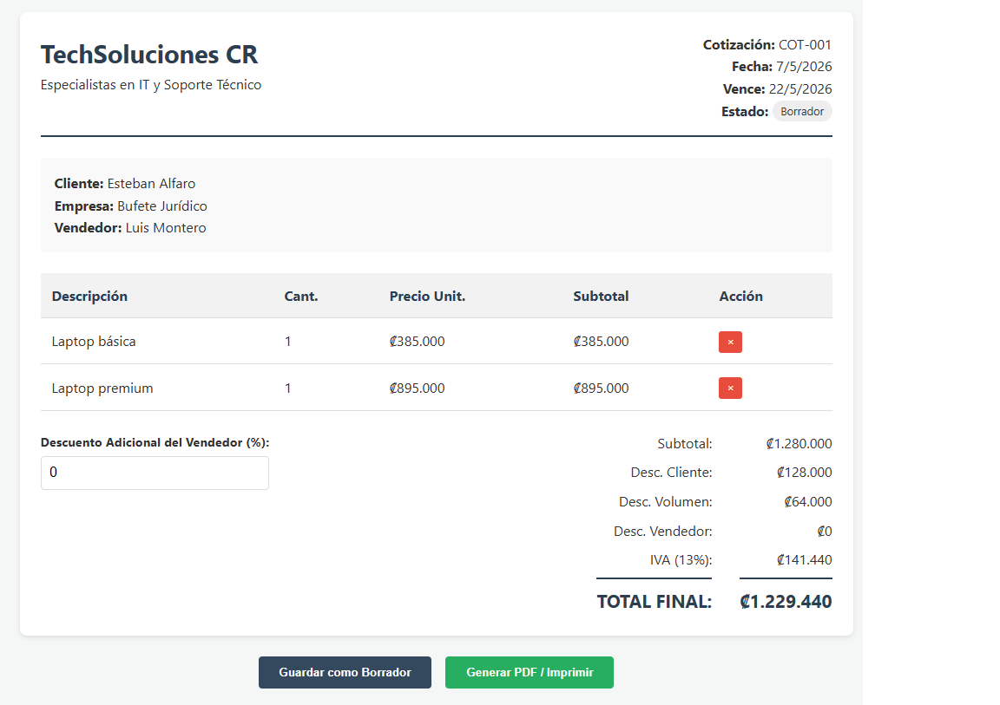
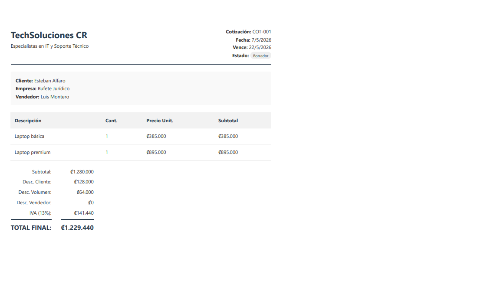

# Quotation System 💼

This is a simple web-based quotation system developed as part of my learning journey in AI-assisted programming and frontend development.

## 📌 Project Description
This application allows users to create service or product quotations in a simple and interactive way. 
It helps reduce manual calculations, improves the organization of quotation data, and allows users to export quotations as PDF files.

## 🧠 What I practiced in this project
- Computational thinking
- Problem decomposition
- Input validation
- DOM manipulation with JavaScript
- UI design with HTML/CSS

## 🛠️ Technologies used
- HTML
- CSS
- JavaScript

## 🌐 Live Demo
https://estebanalfaro.github.io/quotation-system/

## 📷 Project Screenshots

### Main page

### Quotation form

### Result

## 📁 Project Structure
- index.html
- style.css
- script.js

## 🚀 Future improvements
- Add database support
- Improve UI design
- Add user authentication

---

Feel free to give feedback!
